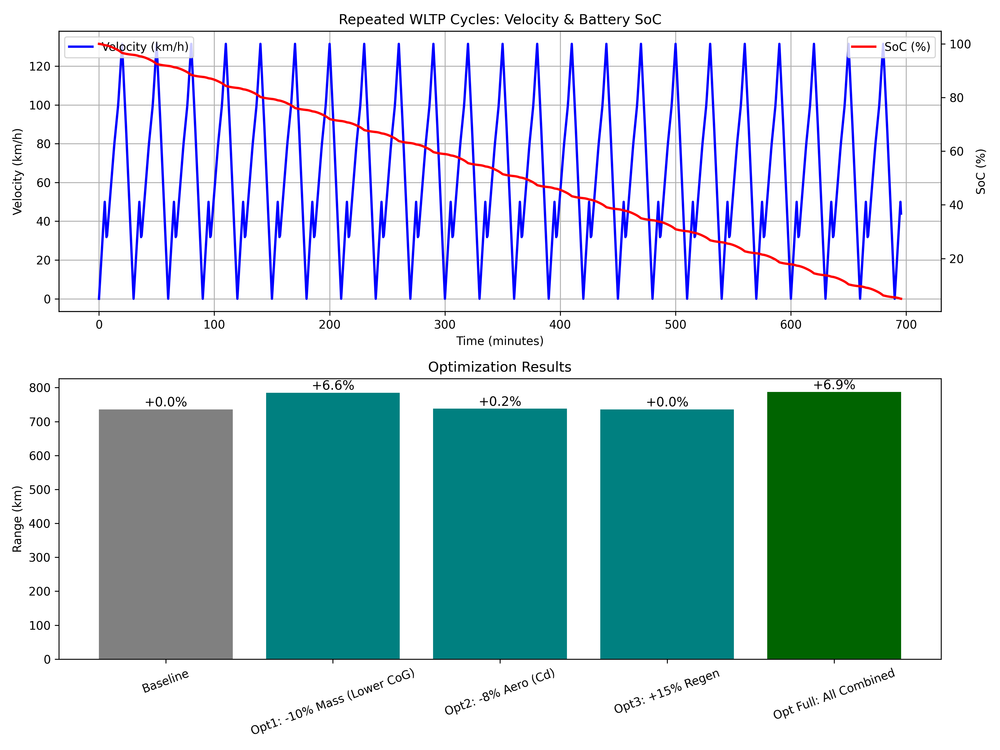

# EV Powertrain Efficiency Simulator

Physics-based Python model of a 60 kWh electric vehicle (inspired by Tesla Model 3) simulating range over repeated WLTP drive cycles.

## Key Features
- Models battery discharge, motor/regenerative braking efficiency, aerodynamic drag, rolling resistance, and accessory loads.
- Optimizes parameters: vehicle mass (lower CoG), drag coefficient (Cd), and regen efficiency.
- Results: Up to **6.9% range increase** (736 → 787 km) and **6% lower energy consumption** (77 → 72 Wh/km) via combined optimizations.
- Generates visualizations: Velocity/SoC over time + range gain bar chart.

## Motivation
Personal project to demonstrate understanding of EV powertrain dynamics, efficiency trade-offs, and manufacturing-relevant KPIs (e.g., analogs to OEE/production balance). Built with skills in Python, NumPy, and Matplotlib.

## Results


Baseline: 736 km range | Optimized: +6.9% (mass + aero + regen)

## How to Run
```bash
python ev_powertrain_sim.py
